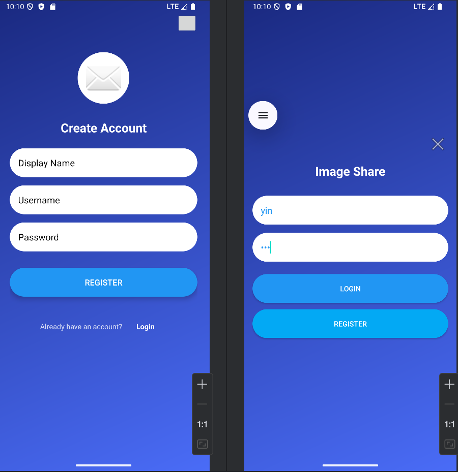
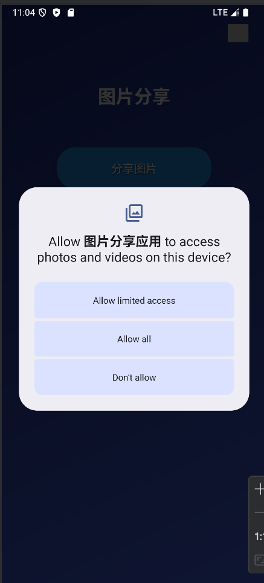
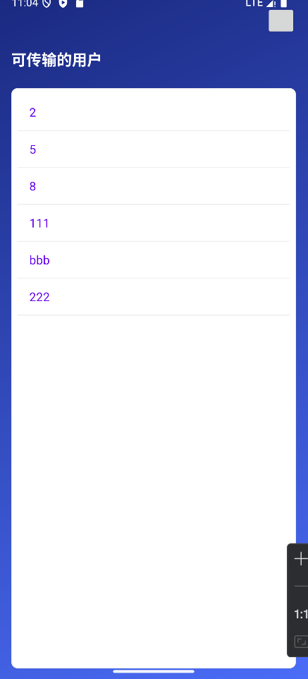
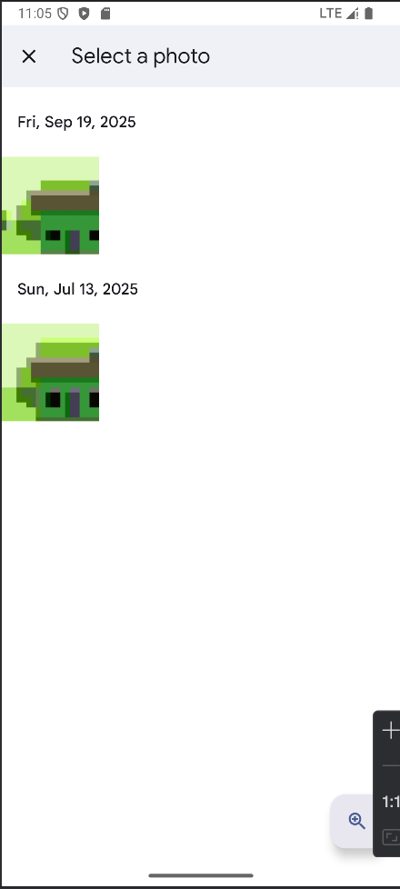
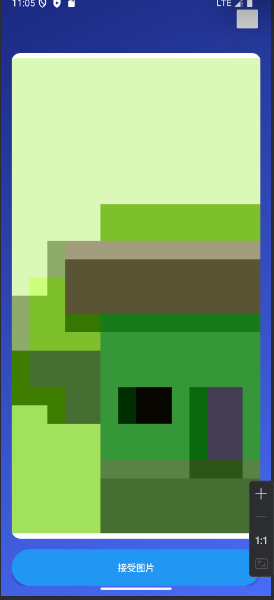

# ImageShare - 基于 Android 与 Spring Boot 的局域网图片分享系统

##  项目简介
ImageShare 是一款基于 C/S（客户端/服务器）架构的轻量级局域网图片分享应用。系统由 **Android 客户端** 和 **Java Spring Boot 后端** 组成，旨在解决无外网或企业内部局域网环境下的图片定向传输需求。用户可以通过 Android 端注册登录、获取在线用户列表、选择图片进行定向发送；接收端可以拉取待接收图片，并一键保存至本地系统相册。后端提供完整的 RESTful API 并实现了服务关闭时的垃圾资源回收机制。

##  功能清单
**客户端（Android）**：
- **用户认证**：注册、登录及退出登录，基于 SharedPreferences 实现用户状态持久化。
- **动态权限申请**：完美适配 Android 13+ (READ_MEDIA_IMAGES) 及低版本 (READ_EXTERNAL_STORAGE) 存储权限。
- **图片发送**：获取在线用户列表，选择目标接收人，从系统相册选图并上传至服务器。
- **图片接收**：轮询拉取当前用户的待接收图片，异步下载并在 UI 线程展示，支持一键保存至系统相册并通知服务器标记为已接收。
- **UI/UX**：统一的渐变背景主题，自定义按钮、输入框及列表样式，提升交互体验。

**服务端（Spring Boot）**：
- **RESTful API**：提供用户注册、登录、用户列表获取、图片上传、待接收图片拉取、标记已接收等接口。
- **数据持久化**：使用 MySQL 存储用户信息与图片分享记录，通过 MyBatis-Plus 完成 ORM 映射。
- **密码安全**：基于 BCrypt 对用户密码进行加盐哈希存储，杜绝明文落库。
- **资源清理机制**：利用 `@PreDestroy` 生命周期钩子，在服务正常关闭时自动清理未接收的图片文件及数据库记录，防止磁盘空间泄漏；上传过程具备文件与数据库写入的事务一致性保障。

##  技术栈
- **客户端**：Java, XML Layout, Material Components, Retrofit2 + OkHttp3 (登录/注册/上传), Volley (列表/接收), Gson, ExecutorService, SharedPreferences。
- **服务端**：Java 17, Spring Boot 3.3, Spring Web, MyBatis-Plus 3.5, MySQL 8, Spring Security Crypto (BCrypt), Maven。
- **构建与部署**：Gradle (KTS), Maven, IntelliJ IDEA, Android Studio。

##  系统架构图
`
[Android 客户端] 
  ├─ UI 层: Activity (Login, Main, UserList, ReceiveImage)
  ├─ 网络层: Retrofit2 / Volley (HTTP/1.1 传输)
  └─ 数据层: SharedPreferences, 本地文件存储
       ↓ ↑ (RESTful API over TCP)
[Spring Boot 后端服务]
  ├─ 控制层: ApiController (/login, /upload_image, /get_pending_images 等)
  ├─ 业务层: UserService / ImageService (权限校验、ID 格式校验、文件流处理、BCrypt 加密)
  ├─ 持久层: MyBatis-Plus (UserMapper / SharedImageMapper)
  └─ 数据层: MySQL (imageshare 库) + 本地磁盘 (uploads/)
`

## 项目结构
`
ImageShare/
├── app/                          # Android 客户端代码
│   ├── src/main/java/com/example/imageshare/
│   │   ├── activities/           # UI 页面与逻辑
│   │   ├── api/                  # Retrofit 配置与接口定义
│   │   └── models/               # 数据实体类
│   └── build.gradle.kts
├── springboot-backend/           # Java Spring Boot 服务端代码
│   ├── src/main/java/com/example/imageshare/server/
│   │   ├── controller/           # REST 接口 (ApiController)
│   │   ├── service/              # 业务逻辑 (UserService / ImageService)
│   │   ├── mapper/               # MyBatis-Plus 数据访问
│   │   ├── entity/               # 数据库实体 (User / SharedImage)
│   │   └── dto/                  # 请求/响应传输对象
│   ├── src/main/resources/
│   │   ├── application.yml       # 数据源、端口、上传目录配置
│   │   └── schema.sql            # 建表脚本 (启动时自动执行)
│   └── pom.xml
├── uploads/                      # 图片上传目录 (自动生成)
└── README.md
`

## 快速开始
1. 准备 MySQL 数据库
   确保本地已安装并启动 MySQL 8+。无需手动建库，配置中的 `createDatabaseIfNotExist=true` 会在启动时自动创建 `imageshare` 库，`schema.sql` 会自动建表。
   如账号密码与默认值不同，请修改 `springboot-backend/src/main/resources/application.yml` 中的 `username` / `password`（默认 root / 123456，也支持通过环境变量 `MYSQL_USER`、`MYSQL_PASSWORD` 覆盖）。
2. 启动后端服务
   确保电脑已安装 JDK 17+ 与 Maven 环境。
    进入 springboot-backend 目录，启动服务器（服务将运行在 0.0.0.0:5000）：
    `mvn spring-boot:run`
3. 配置并运行 Android 客户端
   使用 Android Studio 打开根目录下的 app 项目。
   打开 `app/src/main/java/com/example/imageshare/api/ApiClient.java`，将 BASE_URL 修改为你运行后端服务电脑的局域网 IP 地址（例如：http://192.168.1.100:5000/；模拟器可使用默认的 http://10.0.2.2:5000/）。
   确保手机和电脑连接在同一个 Wi-Fi 或局域网下。
   编译并安装 App 到真机或模拟器。

## 后端 API 接口说明
POST /register
参数：username, password, displayName
说明：用户注册，密码经 BCrypt 加密后存储。

POST /login
参数：username, password
说明：用户登录，返回用户 ID、用户名及显示名称。

GET /users
参数：无
说明：获取所有注册用户列表，用于客户端展示可分享对象。

POST /upload_image
参数：image (文件流), senderId, recipientId
说明：上传图片并指定接收者，服务器将图片存入 uploads 目录并记录数据库。

GET /get_pending_images
参数：userId
说明：获取指定用户的待接收图片列表（is_received = 0）。

POST /mark_image_received
参数：imageId
说明：标记图片为已接收，并删除服务器本地的图片文件。

GET /uploads/{filename}
参数：文件名
说明：访问已上传的静态图片资源（含路径穿越防护）。

## 运行截图

(注册与登录界面)

(分享图片)

(传输对象)

(选择相册图片)

(接收图片)

## 开源协议
本项目采用 MIT License 开源协议。

## 作者
2300310521 马鸿远
GitHub：@Kiri-Colina
如果这个项目对你有帮助，欢迎 Star ⭐！
